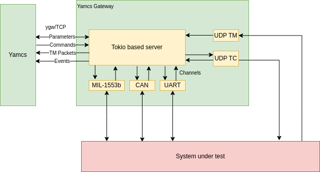

Yamcs Gateway

The goal of this project is to allow Yamcs to control instruments/payloads as part of an EGSE. 

It is implemented in Rust to allow close to realtime behavior. The connection to Yamcs is via TCP.

As seen in the diagram below the program is composed of an async part on top of tokio interacting with a set of components (called ``ygw nodes``) that implement the communication with the hardware devices. The nodes may chose to be sync or async and the sync ones can run into their own thread set to realtime priority if required. Communication between the async and sync nodes is done using Tokio channels.



Each node (corresponding to an end device) gets assigned a name and a u32 id. The names and ids are communicated to Yamcs which will use them to route commands and parameters.

This crate (yamcs-if) contains the code for communication with Yamcs and several standard nodes:
 - UDP TM - receives TM packets via UDP and passes them to Yamcs
 - UDP TC - passes TC from Yamcs via UDP to a remote device.

The create does not contain an executable. Each project should setup a separate binary executable crate combining the components from this crate possibly with its own components.


**Node implementation and usage**
To create a node, each implementation will have to implement the YgwNode trait

```rust
#[async_trait]
pub trait YgwNode:Send {
    /// the properties of the node (name, description,...) - will be communicated to Yamcs
    fn properties(&self) -> &YgwLinkNodeProperties;

    /// the list of sub links - will also be communicated to Yamcs
    fn sub_links(&self) -> &[Link];

    /// method called by the ygw server to run the node
    /// tx and rx are used to communicate between the node and the server
    /// the node_id is the id allocated to this node, it has to be used for all the messages sent to the server
    async fn run(&mut self, node_id: u32, tx: Sender<YgwMessage>, rx: Receiver<YgwMessage>);
}
``` 

Once the nodes have been implemented, the main program will look something like:
```rust
  fn async main() {
    let addr = ([127, 0, 0, 1], 56789).into();
    let node1 = ...
    let node2 = ...
    let server = ServerBuilder::new(addr)
        .add_node(Box::new(node1))
        .add_node(Box::new(node2))
        .build();
    let server_handle = server.start().await.unwrap();

    server_handle.join();
  }
```

In Yamcs, each node appears as a link with possible sub-links. The link up/down commands and events are propagated from Yamcs to the node as messages.

The quickstart project illustrates the usage of the ygw framework for building an executable. It also showcases the ygw-macros crate for easing the publishing of parameters and commands in Yamcs.